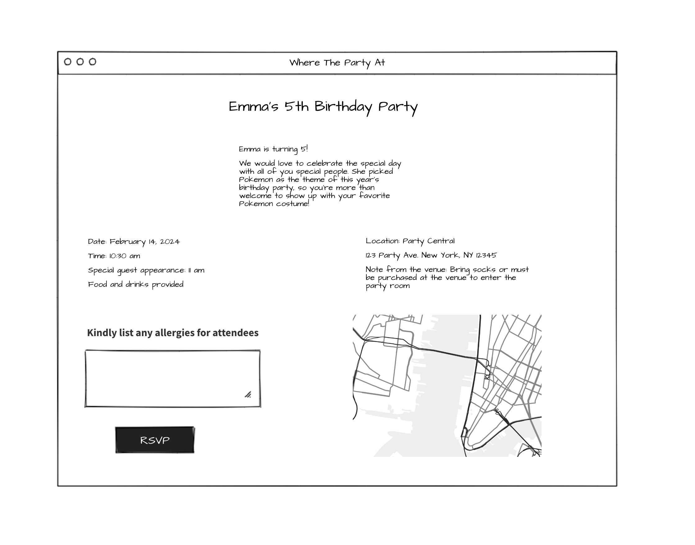

# Capstone Project - Where the Party At

**Project By:** Christine Wong
- [**LINK TO GITHUB**](https://github.com/cwon07/)
- [**LINK TO DEPLOYED WEBSITE**](https://render.com)

## Description

Where the Party At is an event management system. The idea came when I found myself juggling to RSVP, keep track of the date, location, buying presents, etc. to so many event invites for my family. 

Where the Party At enables users - party hosts - to create events, manage event details such as date, time, location, and attendees. 
Attendees can easily find the venue using the embedded Google Maps and plan their route to the party location. Attendees can also note if they have any allergies.
With the RSVP management, the host can keep track of RSVPs and choose to send out email reminders if they haven't responded by certain date. 
There's a gift registry option to provide attendees ideas on what the person would like for their special day. 

## Tech Stack

Angular, TailwindCSS, PostgreSQL, Node, Express

## Mock UP of UI

 

## Roadmap

Watch Angular tutorials and familiarize with the codes
